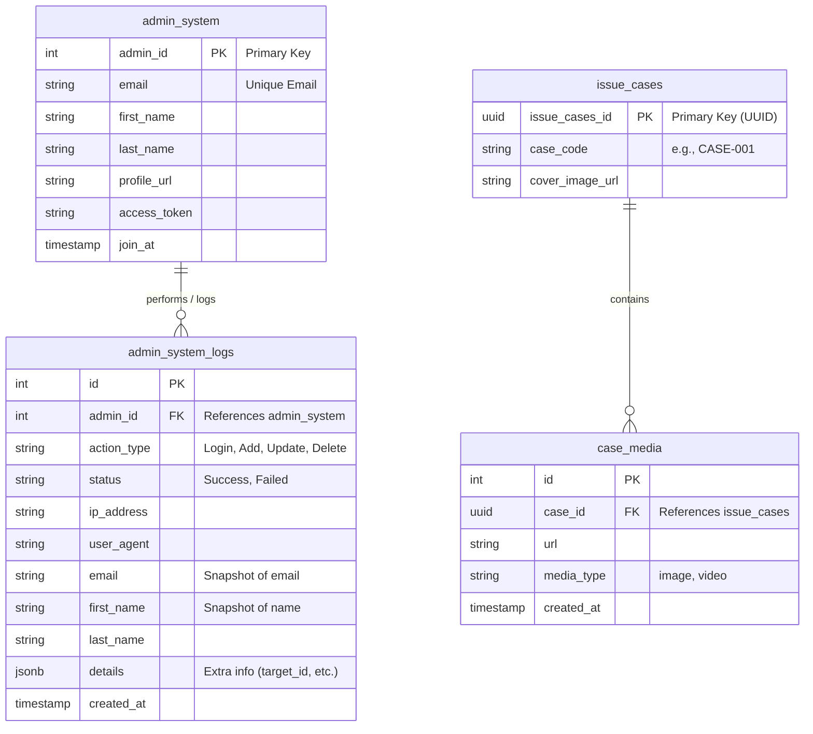

# Internal Web API

This project is a Node.js and Express-based API for managing an internal system. It provides endpoints for admin management, case management, and authentication. The API is designed to be deployed as a Vercel Edge Function.

## Database Schema

## API Endpoints

### Admin Authentication

#### `POST /api/admin-login`

Handles admin login.

-   **Request Body:**
    -   `email` (string, required): The admin's email.
    -   `first_name` (string): The admin's first name.
    -   `last_name` (string): The admin's last name.
    -   `profile_url` (string): The admin's profile URL.
    -   `access_token` (string, required): The access token from the authentication provider.
-   **Responses:**
    -   `200 OK`: Login successful. Returns the admin's data.
    -   `403 Forbidden`: The email is not authorized.
    -   `500 Internal Server Error`: An error occurred.

### Admin Management

#### `GET /api/admin-list`

Retrieves a list of all admins.

-   **Responses:**
    -   `200 OK`: Returns an array of admin objects.

#### `POST /api/admin-list`

Creates a new admin.

-   **Request Body:**
    -   `current_admin_id` (integer, required): The ID of the admin performing the action.
    -   `email` (string, required): The new admin's email.
-   **Responses:**
    -   `201 Created`: The admin was created successfully. Returns the new admin's data.
    -   `400 Bad Request`: Missing required fields.

#### `PUT /api/admin-list?id=<admin_id>`

Updates an admin's information.

-   **URL Parameters:**
    -   `id` (integer, required): The ID of the admin to update.
-   **Request Body:**
    -   `current_admin_id` (integer, required): The ID of the admin performing the action.
    -   `email` (string): The admin's new email.
    -   `first_name` (string): The admin's new first name.
    -   `last_name` (string): The admin's new last name.
-   **Responses:**
    -   `200 OK`: The admin was updated successfully. Returns the updated admin's data.
    -   `400 Bad Request`: Missing admin ID.
    -   `404 Not Found`: The admin was not found.

#### `DELETE /api/admin-list?id=<admin_id>`

Deletes an admin.

-   **URL Parameters:**
    -   `id` (integer, required): The ID of the admin to delete.
-   **Request Body:**
    -   `current_admin_id` (integer, required): The ID of the admin performing the action.
-   **Responses:**
    -   `200 OK`: The admin was deleted successfully.
    -   `400 Bad Request`: Missing admin ID.
    -   `404 Not Found`: The admin was not found.

### Case Management

#### `GET /api/cases/search?id=<case_code>`

Searches for a case and its associated media.

-   **URL Parameters:**
    -   `id` (string, required): The `case_code` to search for.
-   **Responses:**
    -   `200 OK`: Returns the case data, including an array of media files.
    -   `400 Bad Request`: Missing case ID.
    -   `404 Not Found`: The case was not found.

#### `PUT /api/cases/manage?id=<case_id>`

Updates a case's cover image or a media item's URL.

-   **URL Parameters:**
    -   `id` (string, required): The `issue_cases_id` of the case to update.
-   **Request Body:**
    -   `current_admin_id` (integer, required): The ID of the admin performing the action.
    -   `cover_image_url` (string, optional): The new URL for the case's cover image.
    -   `media_id` (integer, optional): The ID of the media item to update.
    -   `media_url` (string, optional): The new URL for the media item.
-   **Responses:**
    -   `200 OK`: The update was successful.
    -   `400 Bad Request`: Missing case ID or nothing to update.

## Monitored Files

- `/Users/taned/Desktop/intern/internal_web_api/api/organization/search_org.js`
- `/Users/taned/Desktop/intern/internal_web_api/api/cases/search_case.js`
- `/Users/taned/Desktop/intern/internal_web_api/api/AdminList.js`
- `/Users/taned/Desktop/intern/internal_web_api/api/AdminLogin.js`
- `/Users/taned/Desktop/intern/internal_web_api/api/cases/manage_case.js`
- `/Users/taned/Desktop/intern/internal_web_api/api/flex_message/manage_flex_message.js`
- `/Users/taned/Desktop/intern/internal_web_api/api/organization/manage_org.js`
- `/Users/taned/Desktop/intern/internal_web_api/index.js`
