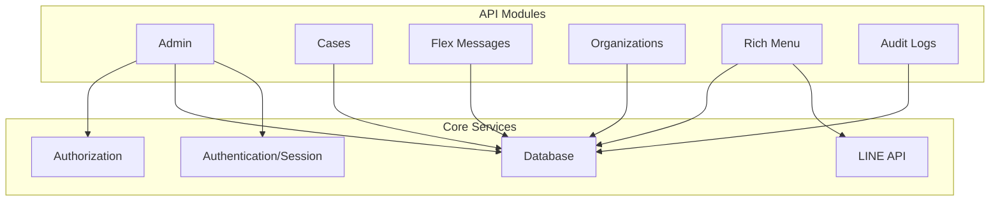
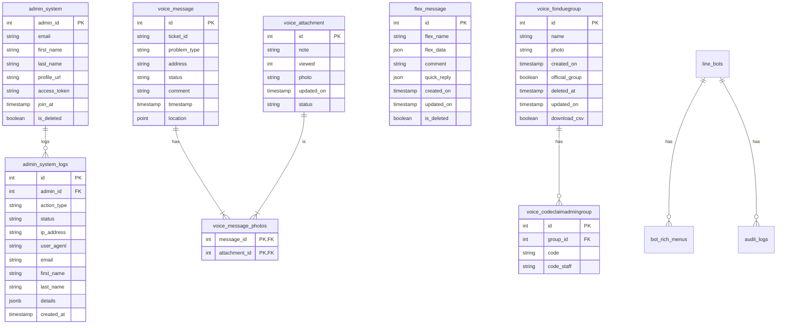
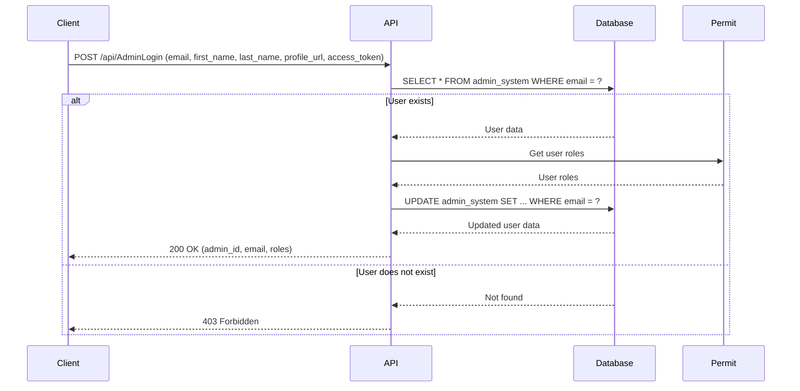
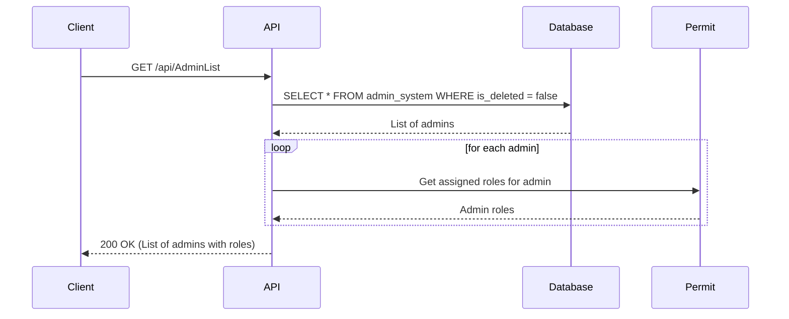

# Internal Web API

This project is a Node.js and Express-based API for managing an internal system. It provides endpoints for admin management, case management, and authentication. The API is designed to be deployed as a Vercel Edge Function.

## Architecture Overview

The API is structured into modules, each responsible for a specific domain:

-   **Admin:** Manages admin users, roles, and authentication.
-   **Cases:** Handles case creation, retrieval, and updates.
-   **Flex Messages:** Manages LINE Flex Messages and validation.
-   **Organizations:** Manages organization data and proxy search.
-   **Rich Menu:** Comprehensive management of LINE Rich Menus and bots.
-   **Audit Logs:** Tracking system activities and admin actions.

## Database Schema

## API Endpoints

### Admin Authentication & Session

#### `POST /api/AdminLogin`

Handles admin login.

-   **Request Body:**
    -   `email` (string, required): The admin's email.
    -   `first_name` (string): The admin's first name.
    -   `last_name` (string): The admin's last name.
    -   `profile_url` (string): The admin's profile URL.
    -   `access_token` (string, required): The access token from the authentication provider.
-   **Responses:**
    -   `200 OK`: Login successful. Returns the admin's data.
    -   `403 Forbidden`: The email is not authorized.
    -   `500 Internal Server Error`: An error occurred.

#### `POST /api/CheckSession`

Verifies if an admin session is still valid.

-   **Request Body:**
    -   `email` (string, required): Admin email.
    -   `access_token` (string, required): Current access token.
-   **Responses:**
    -   `200 OK`: Authenticated successfully.
    -   `401 Unauthorized`: Session mismatch or expired.
    -   `403 Forbidden`: Account deactivated.
    -   `404 Not Found`: User not found.

#### `GET /api/GetUserRoles`

Retrieves the roles assigned to the current user from Permit.io.

-   **Headers:** Requires `access_token` in cookies.
-   **Responses:**
    -   `200 OK`: Returns roles and validity status.
    -   `401 Unauthorized`: No token or invalid session.

### Admin Management

#### `GET /api/AdminList`

Retrieves a list of all admins.

-   **Responses:**
    -   `200 OK`: Returns an array of admin objects.

#### `POST /api/AdminList`

Creates a new admin or reactivates a deleted one.

#### `PUT /api/AdminList?id=<admin_id>`

Updates an admin's information.

#### `DELETE /api/AdminList?id=<admin_id>`

Soft deletes an admin.

#### `GET /api/GetAuditLogs`

Retrieves system audit logs from Google Cloud Logging.

-   **URL Parameters:**
    -   `limit` (integer): Number of logs to return.
    -   `actionType` (string): Filter by action.
    -   `email` (string): Filter by admin email.
    -   `status` (string): Filter by status (SUCCESS/FAILED).
-   **Responses:**
    -   `200 OK`: Returns a list of log entries.

### Case Management

#### `GET /api/cases/search_case?id=<ticket_id>`

Searches for a case and its associated media.

#### `PUT /api/cases/manage_case?id=<case_id>`

Updates a media item's URL within a case.

### Flex Message Management

#### `GET /api/flex_message/manage_flex_message`

Retrieves all Flex Messages.

#### `POST /api/flex_message/validate-push`

Validates Flex Message JSON structure using LINE's validation API.

-   **Request Body:** Flex Message JSON content.
-   **Responses:**
    -   `200 OK`: Validation passed.
    -   `400 Bad Request`: Validation failed with details from LINE.

### Organization Management

#### `GET /api/organization/search_org?q=<query>`

Searches for an organization by ID or name.

#### `GET /api/proxy-search-org/search-org?search=<query>`

Proxies organization search requests to an external PHP backend.

-   **URL Parameters:**
    -   `search` (string, required): Search term.
    -   `limit` (integer): Max results.
-   **Responses:**
    -   `200 OK`: Returns search results from proxy.

### Rich Menu Management

#### `GET /api/richmmenu/richmenu_home`

Manages bot registrations and high-level rich menu synchronization.
-   **Actions (`?action=...`):**
    -   `list_bots`: List all registered LINE bots.
    -   `current`: Get the active rich menu for a bot.

#### `POST /api/richmmenu/richmenu_home`

-   **Actions (`?action=...`):**
    -   `verify_token`: Validate a LINE Channel Access Token.
    -   `add_bot`: Register a new bot.
    -   `delete_bot`: Soft-delete a bot.
    -   `sync`: Sync rich menus from LINE to the local database.

#### `GET /api/richmmenu/richmenu_dashboard`

Detailed rich menu operations and assets.
-   **Actions (`?action=...`):**
    -   `list`: List all menus for a specific bot.
    -   `details`: Get JSON structure of a rich menu.
    -   `image`: Proxy/retrieve the rich menu image.
    -   `audit_logs`: Get bot-specific activity logs.

#### `POST /api/richmmenu/richmenu_dashboard`

-   **Actions (`?action=...`):**
    -   `upload`: Create a new rich menu and upload its image.
    -   `save_flow`: Save state machine/interaction flow for a rich menu.
    -   `delete`: Soft-delete a rich menu.

## Core Utilities (`/src/lib`)

-   **`db.js`**: PostgreSQL connection pooling and query execution.
-   **`lineApi.js`**: Helper for making authenticated requests to LINE Messaging API.
-   **`logging.js`**: Centralized logging utility for system and audit events.
