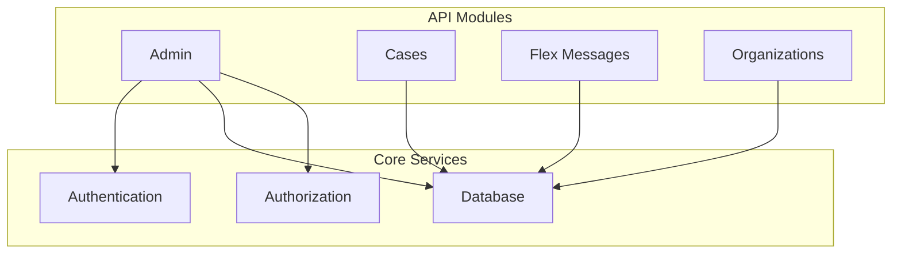
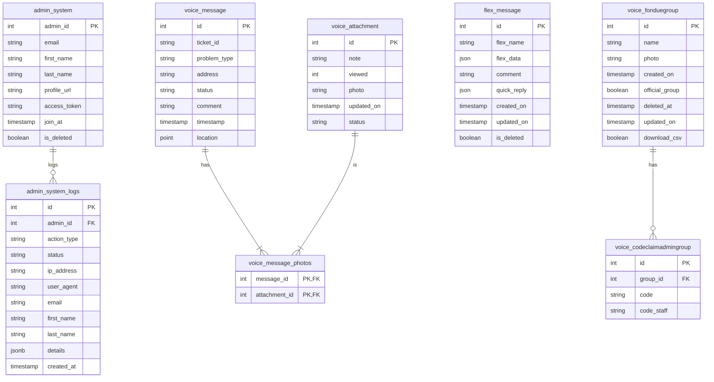

# Internal Web API

This project is a Node.js and Express-based API for managing an internal system. It provides endpoints for admin management, case management, and authentication. The API is designed to be deployed as a Vercel Edge Function.

## Architecture Overview

The API is structured into modules, each responsible for a specific domain:

-   **Admin:** Manages admin users, roles, and authentication.
-   **Cases:** Handles case creation, retrieval, and updates.
-   **Flex Messages:** Manages LINE Flex Messages.
-   **Organizations:** Manages organization data.

## Database Schema

## API Endpoints

### Admin Authentication

#### `POST /api/AdminLogin`

Handles admin login.

-   **Request Body:**
    -   `email` (string, required): The admin's email.
    -   `first_name` (string): The admin's first name.
    -   `last_name` (string): The admin's last name.
    -   `profile_url` (string): The admin's profile URL.
    -   `access_token` (string, required): The access token from the authentication provider.
-   **Responses:**
    -   `200 OK`: Login successful. Returns the admin's data.
    -   `403 Forbidden`: The email is not authorized.
    -   `500 Internal Server Error`: An error occurred.

### Admin Management

#### `GET /api/AdminList`

Retrieves a list of all admins.

-   **Responses:**
    -   `200 OK`: Returns an array of admin objects.

#### `POST /api/AdminList`

Creates a new admin or reactivates a deleted one.

-   **Request Body:**
    -   `current_admin_id` (integer, required): The ID of the admin performing the action.
    -   `email` (string, required): The new admin's email.
    -   `role` (string, required): The role to assign to the admin.
-   **Responses:**
    -   `200 OK`: The admin was created or updated successfully.
    -   `400 Bad Request`: Missing required fields.

#### `PUT /api/AdminList?id=<admin_id>`

Updates an admin's information.

-   **URL Parameters:**
    -   `id` (integer, required): The ID of the admin to update.
-   **Request Body:**
    -   `current_admin_id` (integer, required): The ID of the admin performing the action.
    -   `email` (string): The admin's new email.
    -   `first_name` (string): The admin's new first name.
    -   `last_name` (string): The admin's new last name.
-   **Responses:**
    -   `200 OK`: The admin was updated successfully. Returns the updated admin's data.
    -   `400 Bad Request`: Missing admin ID.
    -   `404 Not Found`: The admin was not found.

#### `DELETE /api/AdminList?id=<admin_id>`

Soft deletes an admin.

-   **URL Parameters:**
    -   `id` (integer, required): The ID of the admin to delete.
-   **Request Body:**
    -   `current_admin_id` (integer, required): The ID of the admin performing the action.
-   **Responses:**
    -   `200 OK`: The admin was deactivated successfully.
    -   `400 Bad Request`: Missing admin ID.
    -   `403 Forbidden`: The acting admin does not have permission to delete.
    -   `404 Not Found`: The admin was not found.

### Case Management

#### `GET /api/cases/search_case?id=<ticket_id>`

Searches for a case and its associated media.

-   **URL Parameters:**
    -   `id` (string, required): The `ticket_id` to search for.
-   **Responses:**
    -   `200 OK`: Returns the case data, including an array of media files.
    -   `400 Bad Request`: Missing case ID.
    -   `404 Not Found`: The case was not found.

#### `PUT /api/cases/manage_case?id=<case_id>`

Updates a media item's URL within a case.

-   **URL Parameters:**
    -   `id` (string, required): The `case_id` of the case to update.
-   **Request Body:**
    -   `current_admin_id` (integer, required): The ID of the admin performing the action.
    -   `photo_id` (string, required): The ID of the photo to update.
    -   `file_url` (string, required): The new URL for the media item.
    -   `description` (string): A description of the change.
    -   `viewed` (integer): The viewed status of the media.
    -   `old_url` (string): The old URL of the media item.
-   **Responses:**
    -   `200 OK`: The update was successful.
    -   `400 Bad Request`: Missing required fields.
    -   `404 Not Found`: The photo ID was not found or mismatched.

### Flex Message Management

#### `GET /api/flex_message/manage_flex_message`

Retrieves all Flex Messages.

-   **Responses:**
    -   `200 OK`: Returns an array of Flex Message objects.

#### `POST /api/flex_message/manage_flex_message`

Creates a new Flex Message.

-   **Request Body:**
    -   `current_admin_id` (integer, required): The ID of the admin performing the action.
    -   `flex_name` (string, required): The name of the Flex Message.
    -   `flex_data` (json, required): The Flex Message data.
    -   `comment` (string): A comment for the Flex Message.
    -   `quick_reply` (json): Quick reply data.
-   **Responses:**
    -   `201 Created`: The Flex Message was created successfully.
    -   `403 Forbidden`: Unauthorized.

#### `PUT /api/flex_message/manage_flex_message?id=<flex_id>`

Updates a Flex Message.

-   **URL Parameters:**
    -   `id` (integer, required): The ID of the Flex Message to update.
-   **Request Body:**
    -   `current_admin_id` (integer, required): The ID of the admin performing the action.
    -   `flex_name` (string): The new name of the Flex Message.
    -   `flex_data` (json): The new Flex Message data.
    -   `comment` (string): The new comment.
    -   `quick_reply` (json): The new quick reply data.
-   **Responses:**
    -   `200 OK`: The Flex Message was updated successfully.
    -   `400 Bad Request`: Missing Flex Message ID.
    -   `404 Not Found`: The Flex Message was not found.

#### `DELETE /api/flex_message/manage_flex_message?id=<flex_id>`

Soft deletes a Flex Message.

-   **URL Parameters:**
    -   `id` (integer, required): The ID of the Flex Message to delete.
-   **Request Body:**
    -   `current_admin_id` (integer, required): The ID of the admin performing the action.
-   **Responses:**
    -   `200 OK`: The Flex Message was deleted successfully.
    -   `403 Forbidden`: Unauthorized.
    -   `404 Not Found`: The Flex Message was not found.

### Organization Management

#### `GET /api/organization/search_org?q=<query>`

Searches for an organization by ID or name.

-   **URL Parameters:**
    -   `q` (string, required): The ID or name to search for.
-   **Responses:**
    -   `200 OK`: Returns an array of matching organization objects.
    -   `400 Bad Request`: Missing search query.
    -   `404 Not Found`: No organizations found.

#### `PUT /api/organization/manage_org?id=<group_id>`

Updates or restores an organization.

-   **URL Parameters:**
    -   `id` (integer, required): The ID of the organization to update.
-   **Request Body:**
    -   `current_admin_id` (integer, required): The ID of the admin performing the action.
    -   `name` (string): The new name of the organization.
    -   `file_url` (string): The new photo URL for the organization.
    -   `description` (string): A description of the changes.
    -   `official_group` (boolean): Whether the organization is an official group.
    -   `download_csv` (boolean): Whether CSV download is enabled.
    -   `restore` (boolean): Set to `true` to restore a soft-deleted organization.
    -   `old_name` (string): The previous name of the organization.
    -   `old_url` (string): The previous photo URL.
    -   `old_official` (boolean): The previous official group status.
    -   `old_download` (boolean): The previous CSV download status.
-   **Responses:**
    -   `200 OK`: The organization was updated successfully.
    -   `400 Bad Request`: Missing description for restore.
    -   `403 Forbidden`: Unauthorized.
    -   `404 Not Found`: The organization was not found.

#### `DELETE /api/organization/manage_org?id=<group_id>`

Soft deletes an organization.

-   **URL Parameters:**
    -   `id` (integer, required): The ID of the organization to delete.
-   **Request Body:**
    -   `current_admin_id` (integer, required): The ID of the admin performing the action.
    -   `description` (string, required): A reason for the deletion.
-   **Responses:**
    -   `200 OK`: The organization was deleted successfully.
    -   `400 Bad Request`: Missing description.
    -   `403 Forbidden`: Unauthorized.
    -   `404 Not Found`: The organization was not found.