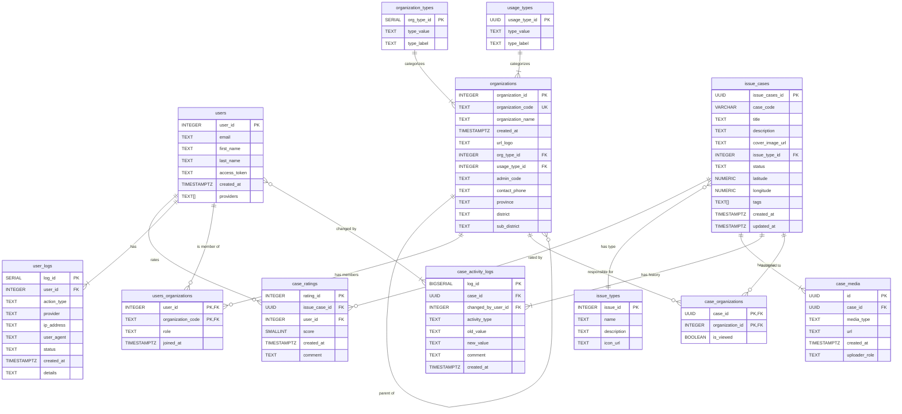

```mermaid
---
config:
  layout: dagre
---
erDiagram
    users {
        INTEGER user_id PK
        TEXT email
        TEXT first_name
        TEXT last_name
        TEXT access_token
        TIMESTAMPTZ created_at
        TEXT[] providers
    }

    usage_types{
        UUID usage_type_id PK
        TEXT type_value
        TEXT type_label
    }

    organizations {
        INTEGER organization_id PK
        TEXT organization_code UK
        TEXT organization_name
        TIMESTAMPTZ created_at
        TEXT url_logo
        INTEGER org_type_id FK
        INTEGER usage_type_id FK
        TEXT admin_code
        TEXT contact_phone
        TEXT province
        TEXT district
        TEXT sub_district
    }
    organization_types {
        SERIAL org_type_id PK
        TEXT type_value
        TEXT type_label
    }
    issue_types {
        INTEGER issue_id PK
        TEXT name
        TEXT description
        TEXT icon_url
    }
    issue_cases {
        UUID issue_cases_id PK
        VARCHAR case_code
        TEXT title
        TEXT description
        TEXT cover_image_url
        INTEGER issue_type_id FK
        TEXT status
        NUMERIC latitude
        NUMERIC longitude
        TEXT[] tags
        TIMESTAMPTZ created_at
        TIMESTAMPTZ updated_at
    }
    user_logs {
        SERIAL log_id PK
        INTEGER user_id FK
        TEXT action_type
        TEXT provider
        TEXT ip_address
        TEXT user_agent
        TEXT status
        TIMESTAMPTZ created_at
        TEXT details
    }
    users_organizations {
        INTEGER user_id PK, FK
        TEXT organization_code PK, FK
        TEXT role
        TIMESTAMPTZ joined_at
    }
    case_media {
        UUID id PK
        UUID case_id FK
        TEXT media_type
        TEXT url
        TIMESTAMPTZ created_at
        TEXT uploader_role
    }
    case_organizations {
        UUID case_id PK, FK
        INTEGER organization_id PK, FK
        BOOLEAN is_viewed
    }
    case_activity_logs {
        BIGSERIAL log_id PK
        UUID case_id FK
        INTEGER changed_by_user_id FK
        TEXT activity_type
        TEXT old_value
        TEXT new_value
        TEXT comment
        TIMESTAMPTZ created_at
    }
    case_ratings {
        INTEGER rating_id PK
        UUID issue_case_id FK
        INTEGER user_id FK
        SMALLINT score
        TIMESTAMPTZ created_at
        TEXT comment
    }
    users ||--o{ case_ratings : "rates"
    issue_cases ||--o{ case_ratings : "rated by"
    users ||--|{ user_logs : "has"
    organization_types ||--|{ organizations : "categorizes"
    usage_types ||--|{ organizations : "categorizes"
    organizations ||--o{ organizations : "parent of"
    users ||--o{ users_organizations : "is member of"
    organizations ||--o{ users_organizations : "has members"
    issue_cases }o--|| issue_types : "has type"
    issue_cases ||--|{ case_media : "has media"
    issue_cases ||--|{ case_activity_logs : "has history"
    users }o--|{ case_activity_logs : "changed by"
    issue_cases ||--o{ case_organizations : "assigned to"
    organizations ||--o{ case_organizations : "responsible for"
```